# Contributing to Haggl

First off, thank you for considering contributing to Haggl! It's people like you that make Haggl such a great tool for small business owners.

## Table of Contents

- [Code of Conduct](#code-of-conduct)
- [Getting Started](#getting-started)
- [Development Setup](#development-setup)
- [Making Changes](#making-changes)
- [Pull Request Process](#pull-request-process)
- [Coding Standards](#coding-standards)
- [Architecture Overview](#architecture-overview)

## Code of Conduct

This project and everyone participating in it is governed by our [Code of Conduct](CODE_OF_CONDUCT.md). By participating, you are expected to uphold this code.

## Getting Started

### Prerequisites

- Python 3.11+
- Node.js 18+
- MongoDB Atlas account (free tier works)
- API keys for: OpenAI, Vapi, Vonage, Exa.ai

### Quick Setup

```bash
# Clone the repository
git clone https://github.com/haggl/haggl.git
cd haggl

# Install Python dependencies
pip install -e ".[dev]"

# Install frontend dependencies
cd frontend && npm install && cd ..

# Copy environment template
cp env.example .env
# Edit .env with your API keys

# Start development servers
python main.py  # Backend on :8001
cd frontend && npm run dev  # Frontend on :3000
```

## Development Setup

### Backend (Python/FastAPI)

```bash
# Create virtual environment
python -m venv .venv
source .venv/bin/activate  # or .venv\Scripts\activate on Windows

# Install with dev dependencies
pip install -e ".[dev]"

# Run tests
pytest

# Run linter
ruff check src/

# Run type checker
mypy src/
```

### Frontend (Next.js)

```bash
cd frontend

# Install dependencies
npm install

# Run development server
npm run dev

# Run linter
npm run lint

# Build for production
npm run build
```

## Making Changes

### Branch Naming

- `feature/` - New features (e.g., `feature/add-vendor-ratings`)
- `fix/` - Bug fixes (e.g., `fix/payment-timeout`)
- `docs/` - Documentation (e.g., `docs/api-reference`)
- `refactor/` - Code refactoring (e.g., `refactor/agent-state-machine`)

### Commit Messages

We follow [Conventional Commits](https://www.conventionalcommits.org/):

```
<type>(<scope>): <description>

[optional body]

[optional footer]
```

Types: `feat`, `fix`, `docs`, `style`, `refactor`, `test`, `chore`

Examples:
```
feat(calling-agent): add parallel vendor calling
fix(payment): handle timeout on ACH transfers
docs(readme): update installation instructions
```

## Pull Request Process

1. **Fork & Branch**: Fork the repo and create your branch from `main`
2. **Develop**: Make your changes with appropriate tests
3. **Test**: Ensure all tests pass (`pytest` and `npm test`)
4. **Lint**: Run linters (`ruff check` and `npm run lint`)
5. **Document**: Update documentation if needed
6. **PR**: Open a Pull Request with a clear description

### PR Checklist

- [ ] Tests added/updated
- [ ] Documentation updated
- [ ] Linters pass
- [ ] Commit messages follow convention
- [ ] PR description explains the change

## Coding Standards

### Python

- **Style**: Follow PEP 8, enforced by Ruff
- **Types**: Use type hints for all functions
- **Docstrings**: Google-style docstrings for public APIs
- **Async**: Use `async/await` for I/O operations

```python
async def call_vendor(
    vendor_id: str,
    product: str,
    quantity: int,
) -> CallResult:
    """
    Initiate a call to a vendor.
    
    Args:
        vendor_id: Unique vendor identifier
        product: Product to order
        quantity: Quantity needed
        
    Returns:
        CallResult with outcome and transcript
        
    Raises:
        VapiError: If call fails to connect
    """
    ...
```

### TypeScript/React

- **Style**: ESLint + Prettier
- **Components**: Functional components with hooks
- **Types**: Explicit types, avoid `any`
- **State**: Use React hooks or Zustand for state

```typescript
interface VendorCardProps {
  vendor: Vendor;
  onSelect: (id: string) => void;
  isSelected?: boolean;
}

export function VendorCard({ vendor, onSelect, isSelected = false }: VendorCardProps) {
  // ...
}
```

## Architecture Overview

```mermaid
flowchart TB
    Frontend["🖥️ Frontend<br/>(Next.js + React)"]
    
    Server["⚡ FastAPI Server<br/>(src/server.py)"]

    subgraph Agents["Agent Layer"]
        Message["💬 Message Agent<br/>(Vonage)"]
        Sourcing["🔍 Sourcing Agent<br/>(Exa.ai)"]
        Calling["📞 Calling Agent<br/>(Vapi)"]
    end

    Evaluation["⚖️ Evaluation Agent<br/>(Voyage AI)"]
    
    Payment["💳 Payment Agent<br/>(Stripe / Browserbase / x402)"]
    
    MongoDB[("🍃 MongoDB Atlas<br/>(State, History, Embeddings, Audit Logs)")]

    Frontend --> Server
    Server --> Message & Sourcing & Calling
    Message & Sourcing & Calling --> Evaluation
    Evaluation --> Payment
    Payment --> MongoDB

    style Frontend fill:#e3f2fd,stroke:#1976d2,color:#000
    style Server fill:#fff3e0,stroke:#f57c00,color:#000
    style Agents fill:#f3e5f5,stroke:#7b1fa2,color:#000
    style Evaluation fill:#fce4ec,stroke:#c2185b,color:#000
    style Payment fill:#e8eaf6,stroke:#3f51b5,color:#000
    style MongoDB fill:#e8f5e9,stroke:#388e3c,color:#000
```



### Agent Communication

Agents communicate through:
1. **Direct function calls** - Within the same process
2. **MongoDB** - Shared state and history
3. **SSE Events** - Real-time updates to frontend

### Adding a New Agent

1. Create directory: `src/new_agent/`
2. Implement: `agent.py`, `schemas.py`, `tools/`
3. Register in `src/server.py`
4. Add routes and event emissions
5. Update frontend to consume events

## Questions?

- Open a [GitHub Issue](https://github.com/haggl/haggl/issues)
- Join our [Discord](https://discord.gg/haggl)
- Email: contributors@haggl.com

Thank you for contributing! 🚀
