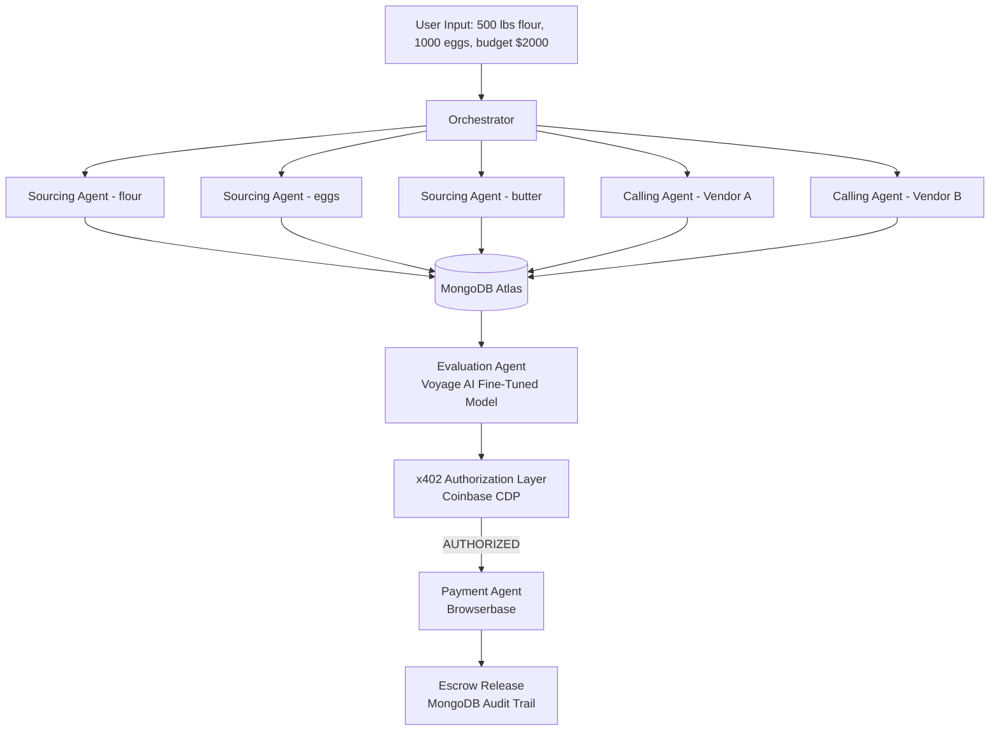

# Haggl

<p align="center">
  
</p>

**AI agents that source, negotiate, and pay for business supplies autonomously.**

Haggl is a multi-agent B2B procurement system built for the MongoDB Agentic Orchestration and Collaboration Hackathon. A business owner inputs ingredient needs, budget constraints, and location. Five specialized agents work concurrently to find suppliers via semantic search, negotiate prices through real phone calls, evaluate options using a fine-tuned preference model, and execute payments through the x402 protocol with **real USDC on Base Sepolia**.

---

**Contributors:**
- Anirudh Kuppili
- Karthik Reddy
- Spencer Yang
- Walter Richard


---

## User Flow



---

## Agent Architecture

| Agent | Sponsor | Function |
|-------|---------|----------|
| **Sourcing Agent** | Research API | Semantic search for wholesale suppliers. Builds multiple query variants, executes parallel searches, extracts structured vendor data. |
| **Calling Agent** | Voice API | Real outbound phone calls to negotiate bulk discounts. AI assistant conducts natural conversation, parses transcripts for confirmed prices. |
| **Evaluation Agent** | Voyage AI | Vendor scoring using fine-tuned preference model. Combines embedding similarity (30%) with explicit parameters (70%). User feedback adjusts weights in real-time. |
| **Message Agent** | Messaging API | SMS/WhatsApp conversational ordering. Business owners text to reorder, approve purchases, or check status. |
| **Payment Agent** | x402 + Browserbase | Cryptographic authorization followed by browser-automated ACH execution. Secure credential injection without AI exposure. |

---

## Technology Stack

| Layer | Technology | Purpose |
|-------|------------|---------|
| **Database** | MongoDB Atlas | Agent state, credentials, escrow, audit |
| **Embeddings** | Voyage AI | Vendor scoring, preference learning |
| **Authorization** | x402 (Coinbase CDP) | Cryptographic spending approval |
| **Browser** | Browserbase | Cloud browser payment execution |
| **Backend** | FastAPI + Python | API server |
| **Frontend** | Next.js + React | Dashboard UI |

---

## Project Structure

```
Haggl/
├── src/
│   ├── sourcing_agent/          # Semantic search + data extraction
│   │   ├── agent.py             # State machine
│   │   └── tools/
│   │
│   ├── calling_agent/           # Voice negotiations
│   │   ├── agent.py             # State machine
│   │   └── tools/
│   │
│   ├── evaluation_agent/        # Voyage AI scoring
│   │   ├── agent.py             # Vendor scoring and selection
│   │   ├── fine_tune.py         # Contrastive preference learning
│   │   └── tools/
│   │
│   ├── message_agent/           # SMS ordering
│   │   ├── agent.py             # Conversation handler
│   │   └── tools/
│   │
│   ├── payment_agent/           # Payment execution
│   │   ├── executor.py          # ACH execution logic
│   │   └── browserbase.py       # Browserbase cloud browser
│   │
│   ├── x402/                    # Authorization layer
│   │   ├── authorizer.py        # Budget enforcement + auth token
│   │   ├── wallet.py            # CDP wallet integration
│   │   ├── credential_vault.py  # AES-256-GCM encrypted storage
│   │   ├── escrow.py            # Escrow lock/release management
│   │   └── mongodb.py           # Database connection
│   │
│   └── server.py                # FastAPI main application
│
├── frontend/                    # Next.js dashboard
├── plans/                       # Architecture documentation
├── configs/                     # Agent configuration files
└── demo_full_flow.py            # Complete demo script
```

---

## Running the Demo

```bash
# Install dependencies
pip install -e .
cd frontend && npm install && cd ..

# Start backend
uvicorn src.server:app --reload --port 8000

# Start frontend (separate terminal)
cd frontend && npm run dev

# Run full payment flow demo
python demo_full_flow.py
```

---

## Hackathon Alignment

| Criterion | Implementation |
|-----------|----------------|
| **Demo (50%)** | Real phone calls, real x402 on-chain transactions, real Browserbase payment execution, all logged to MongoDB |
| **Impact (25%)** | $2.3T B2B procurement market. Saves 5-10 hours/week of manual sourcing. Negotiates 10-20% discounts via AI calls. |
| **Creativity (15%)** | First integration of x402 authorization with legacy ACH execution. Fine-tuned Voyage AI preference model for vendor evaluation. |
| **Pitch (10%)** | Live demo with on-chain proof via BaseScan |

---

## 🌐 Real USDC Testnet Setup

Haggl supports **real USDC transactions** on Base Sepolia testnet:

### Setup Wallets

```python
from eth_account import Account

# Main wallet (sends USDC)
main = Account.create()
print(f"Address: {main.address}")
print(f"Private Key: {main.key.hex()}")

# Escrow wallet (receives authorized USDC)
escrow = Account.create()
print(f"Escrow: {escrow.address}")
```

### Fund the Wallet

1. **ETH for gas**: [Coinbase Faucet](https://www.coinbase.com/faucets/base-ethereum-goerli-faucet)
2. **USDC**: [Circle Faucet](https://faucet.circle.com/) (select Base Sepolia)

### Configure `.env`

```bash
WALLET_PRIVATE_KEY=0xYourPrivateKeyHere
ESCROW_WALLET_ADDRESS=0xYourEscrowAddressHere
```

### Verify Setup

```bash
curl http://localhost:8082/x402/wallet
# Should show: "mode": "web3"
```

**USDC Contract**: `0x036CbD53842c5426634e7929541eC2318f3dCF7e` (Base Sepolia)

---

## License

MIT License

---

Built for the MongoDB Agentic Orchestration and Collaboration Hackathon, January 2026. **Real USDC on Base Sepolia** 🚀
