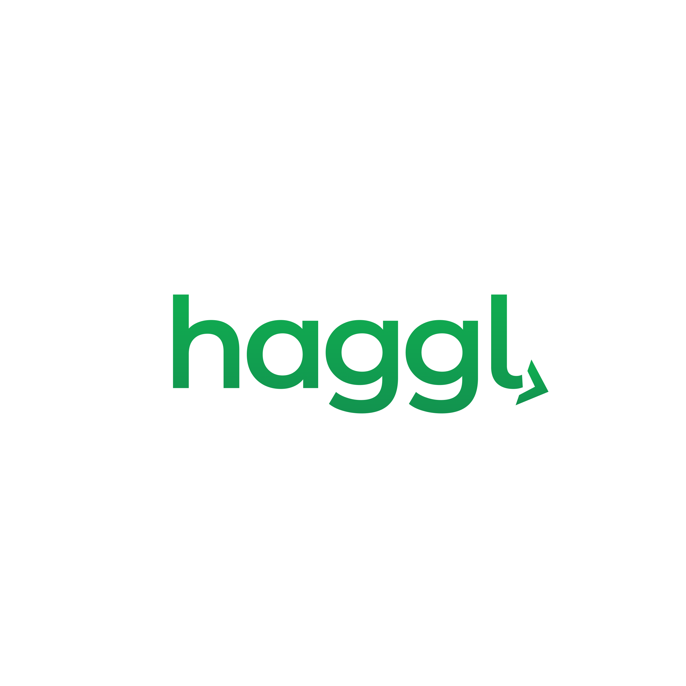

# Haggl

<p align="center">
  
</p>

**AI agents that source, negotiate, and pay for business supplies autonomously.**

Haggl is a multi-agent B2B procurement system built for the MongoDB Agentic Orchestration and Collaboration Hackathon. A business owner inputs ingredient needs, budget constraints, and location. Five specialized agents work concurrently to find suppliers via semantic search, negotiate prices through real phone calls, evaluate options using a fine-tuned preference model, and execute payments through the x402 protocol.

---

**Contributors:**
- Anirudh Kuppili
- Karthik Reddy
- Spencer Yang
- Walter Richard


---

## User Flow

```
                                    USER INPUT
                    "500 lbs flour, 1000 eggs, budget $2,000"
                                        |
                                        v
    +------------------------------------------------------------------+
    |                         ORCHESTRATOR                              |
    |                    (Python asyncio.gather)                        |
    +------------------------------------------------------------------+
                                        |
            +--------------+------------+-----------+--------------+
            |              |            |           |              |
            v              v            v           v              v
    +------------+  +------------+  +------------+  +------------+  +------------+
    | SOURCING   |  | SOURCING   |  | SOURCING   |  | CALLING    |  | CALLING    |
    | flour      |  | eggs       |  | butter     |  | Vendor A   |  | Vendor B   |
    | [Exa.ai]   |  | [Exa.ai]   |  | [Exa.ai]   |  | [Vapi]     |  | [Vapi]     |
    +------------+  +------------+  +------------+  +------------+  +------------+
            |              |            |           |              |
            +--------------+------------+-----------+--------------+
                                        |
                                        v
    +------------------------------------------------------------------+
    |                       MONGODB ATLAS                               |
    |  [suppliers]  [negotiations]  [invoices]  [credentials]  [audit] |
    +------------------------------------------------------------------+
                                        |
                                        v
    +------------------------------------------------------------------+
    |                     EVALUATION AGENT                              |
    |              [Voyage AI Fine-Tuned Model]                         |
    |                                                                   |
    |  - Generates vendor embeddings via Voyage AI                      |
    |  - Scores on quality, affordability, shipping, reliability        |
    |  - User preference learning via contrastive training              |
    |  - Selects optimal vendors within budget                          |
    +------------------------------------------------------------------+
                                        |
                                        v
    +------------------------------------------------------------------+
    |                 x402 AUTHORIZATION LAYER                          |
    |                      [Coinbase CDP]                               |
    |                                                                   |
    |  - Budget enforcement (per-tx, daily, weekly limits)              |
    |  - USDC transfer to escrow wallet (on-chain proof)                |
    |  - Generate single-use cryptographic auth token                   |
    |  - MongoDB escrow lock record                                     |
    +------------------------------------------------------------------+
                                        |
                                   AUTHORIZED
                                        |
                                        v
    +------------------------------------------------------------------+
    |                    PAYMENT AGENT                                  |
    |              [Browserbase + Claude Vision]                        |
    |                                                                   |
    |  - Cloud browser navigates vendor payment portal                  |
    |  - Claude Vision identifies ACH form fields                       |
    |  - Credentials injected from encrypted vault                      |
    |  - AI never sees credential values                                |
    |  - Captures confirmation screenshot                               |
    +------------------------------------------------------------------+
                                        |
                                        v
    +------------------------------------------------------------------+
    |                     ESCROW RELEASE                                |
    |                                                                   |
    |  - Verify ACH confirmation                                        |
    |  - Release USDC to vendor                                         |
    |  - Full audit trail in MongoDB                                    |
    +------------------------------------------------------------------+
```

---

## Agent Architecture

| Agent | Technology | Function |
|-------|------------|----------|
| **Sourcing Agent** | Exa.ai + Claude | Semantic search for wholesale suppliers. Builds multiple query variants, executes parallel searches, extracts structured vendor data. |
| **Calling Agent** | Vapi | Real outbound phone calls to negotiate bulk discounts. AI assistant conducts natural conversation, parses transcripts for confirmed prices. |
| **Evaluation Agent** | Voyage AI | Vendor scoring using fine-tuned preference model. Combines embedding similarity (30%) with explicit parameters (70%). User feedback adjusts weights in real-time. |
| **Message Agent** | OpenAI + Vonage | SMS/WhatsApp conversational ordering. Business owners text to reorder, approve purchases, or check status. |
| **Payment Agent** | x402 + Browserbase | Cryptographic authorization followed by browser-automated ACH execution. Secure credential injection without AI exposure. |

---

## Technical Architecture

### x402 as Universal Authorization Layer

x402 is not a payment processor. It is a cryptographic permission slip that authorizes irreversible real-world actions. ACH is simply one execution backend.

```
+-------------------------------------------------------------------+
|                    THE AUTHORIZATION MODEL                         |
|                                                                    |
|   Evaluation Agent: "Ready to pay $1,847.50 across 4 vendors"     |
|                                |                                   |
|                                v                                   |
|   +--------------------------------------------------------+      |
|   |              x402 AUTHORIZATION LAYER                   |      |
|   |                                                         |      |
|   |   1. Check spending policies (per-tx max: $500)        |      |
|   |   2. Transfer USDC to escrow (on-chain tx hash)        |      |
|   |   3. Create MongoDB escrow lock                         |      |
|   |   4. Generate single-use auth token                     |      |
|   +--------------------------------------------------------+      |
|                                |                                   |
|                           AUTHORIZED                               |
|                                |                                   |
|                                v                                   |
|   +--------------------------------------------------------+      |
|   |              PAYMENT EXECUTION LAYER                    |      |
|   |                                                         |      |
|   |   - Browserbase cloud browser session                  |      |
|   |   - Navigate to vendor payment portal                   |      |
|   |   - Claude Vision parses invoice/form                   |      |
|   |   - Inject ACH credentials (values hidden from AI)      |      |
|   |   - Submit payment, capture confirmation                |      |
|   +--------------------------------------------------------+      |
|                                                                    |
|   VENDOR RECEIVES: Normal ACH payment (no crypto involved)        |
|   WE MAINTAIN: Cryptographic audit trail + escrow management      |
+-------------------------------------------------------------------+
```

### Credential Isolation Architecture

```
+---------------------------------------+---------------------------------------+
|           AI AGENT CAN:               |           AI AGENT CANNOT:            |
+---------------------------------------+---------------------------------------+
|  - See payment portal UI              |  - See credential values              |
|  - Identify form field locations      |  - Type credential values             |
|  - Click buttons and links            |  - Access credential vault directly   |
|  - Read confirmation numbers          |  - Modify spending policies           |
|  - Parse invoice amounts              |  - Bypass x402 authorization          |
|  - Report errors                      |  - Release escrow directly            |
+---------------------------------------+---------------------------------------+
```

The credential vault uses AES-256-GCM encryption with PBKDF2 key derivation. Credentials are decrypted only at the moment of form injection by the execution layer, never exposed to the AI reasoning layer.

### Fine-Tuned Preference Model

The Evaluation Agent uses Voyage AI embeddings trained via contrastive preference learning:

```python
# Training Pipeline (1000 examples)
1. Generate (query, positive_vendor, negative_vendor) triplets
2. Compute embeddings for all texts via Voyage AI
3. Learn preference direction vectors: positive_emb - negative_emb
4. Categorize into quality, affordability, shipping, reliability
5. Average and normalize preference vectors per parameter

# Inference
final_score = 0.30 * embedding_similarity + 0.70 * parameter_score
parameter_score = sum(weight[i] * score[i] for i in [quality, afford, ship, reliable])
```

User feedback (UP/DOWN buttons on each parameter) adjusts weights with a learning rate of 0.05, redistributing across other parameters to maintain constraints. Min weight: 5%, max weight: 60%.

### MongoDB Collections

| Collection | Purpose | Features |
|------------|---------|----------|
| `suppliers` | Vendor database from sourcing | Vector Search index |
| `negotiations` | Call transcripts and outcomes | TTL auto-expire (30 days) |
| `invoices` | Received invoices awaiting payment | |
| `credentials` | Encrypted ACH routing/account numbers | Field-level encryption |
| `escrow_locks` | Active escrow records | |
| `escrow_releases` | Completed escrow releases | |
| `authorizations` | x402 authorization records | |
| `payments` | Payment execution records | Time Series |
| `audit_log` | Security audit trail | |

MongoDB is central to agent coordination. Without it, agents cannot share state, track escrow, or maintain audit trails.

---

## Key Architectural Decisions

### 1. x402 for Authorization, ACH for Execution

**Decision:** Use x402 as the authorization layer while executing payments through traditional ACH rails via browser automation.

**Rationale:** Vendors don't accept crypto. x402 provides agent-native spending controls, cryptographic audit trails, and budget enforcement. The browser automation layer bridges modern AI authorization to legacy payment infrastructure. When vendors eventually support crypto, we swap the execution backend without changing the authorization model.

### 2. Credential Vault with Runtime-Only Decryption

**Decision:** Store ACH credentials encrypted at rest, decrypt only at the moment of form injection, never expose to AI layer.

**Rationale:** AI agents making autonomous payments creates significant security risk. The credential vault ensures that even if an agent is compromised or hallucinating, it physically cannot access banking credentials. The vault API only returns credential_id references; actual values are injected by a separate execution service.

### 3. Contrastive Preference Learning over Full Fine-Tuning

**Decision:** Use contrastive triplet learning to create preference direction vectors rather than fully fine-tuning Voyage AI.

**Rationale:** Full fine-tuning requires more data, compute, and time than a hackathon allows. Contrastive learning achieves "soft fine-tuning" by computing the direction in embedding space that corresponds to each preference (quality, affordability, etc.). This allows real-time preference adjustment via simple vector arithmetic.

### 4. Concurrent Agent Execution via asyncio

**Decision:** Run sourcing and calling agents concurrently using Python's asyncio.gather().

**Rationale:** Sequential execution would take 5-10 minutes for a typical order. Concurrent execution completes the same flow in under 3 minutes. The orchestrator batches independent operations (searching for flour vs. searching for eggs) while preserving sequential dependencies (evaluation must wait for all sourcing results).

### 5. Browserbase Over Local Playwright

**Decision:** Use Browserbase cloud browser service rather than local Playwright instances.

**Rationale:** Local browser automation exposes the execution environment to credential handling. Browserbase provides an isolated, ephemeral browser session where credentials are injected server-side. Screenshots are captured for audit without local storage. Sessions auto-terminate, leaving no residual state.

### 6. Escrow-Based Payment Release

**Decision:** Lock USDC in escrow upon x402 authorization, release only after payment confirmation.

**Rationale:** ACH payments can fail after submission. Without escrow, the authorization would be consumed with no guarantee of vendor payment. The escrow pattern ensures funds are reserved, payment is attempted, and only released upon confirmation. If payment fails, escrow can be reclaimed.

---

## Technology Stack

| Layer | Technology | Purpose |
|-------|------------|---------|
| **Database** | MongoDB Atlas | Agent state, credentials, escrow, audit |
| **AI/LLM** | Claude API (Anthropic) | Reasoning, extraction, vision |
| **Search** | Exa.ai | Semantic supplier discovery |
| **Voice** | Vapi | Real phone call negotiations |
| **Embeddings** | Voyage AI | Vendor scoring, preference learning |
| **Messaging** | Vonage | SMS/WhatsApp ordering |
| **Authorization** | x402 (Coinbase CDP) | Cryptographic spending approval |
| **Browser** | Browserbase | Cloud browser payment execution |
| **Backend** | FastAPI + Python | API server |
| **Frontend** | Next.js + React | Dashboard UI |

---

## Project Structure

```
Haggl/
├── src/
│   ├── sourcing_agent/          # Exa.ai search + Claude extraction
│   │   ├── agent.py             # State machine (IDLE → SEARCHING → EXTRACTING → COMPLETED)
│   │   └── tools/
│   │       ├── exa_tool.py      # Exa.ai API integration
│   │       ├── extractor.py     # Claude-based vendor data extraction
│   │       └── storage.py       # Local JSON caching
│   │
│   ├── calling_agent/           # Vapi voice negotiations
│   │   ├── agent.py             # State machine (READY → IN_PROGRESS → CONFIRMED/FAILED)
│   │   └── tools/
│   │       └── vapi_tool.py     # Vapi API for outbound calls
│   │
│   ├── evaluation_agent/        # Voyage AI scoring
│   │   ├── agent.py             # Vendor scoring and selection
│   │   ├── fine_tune.py         # Contrastive preference learning
│   │   └── tools/
│   │       └── voyage_tool.py   # Voyage AI embeddings
│   │
│   ├── message_agent/           # SMS ordering
│   │   ├── agent.py             # Conversation handler
│   │   └── tools/
│   │       └── vonage_tool.py   # Vonage Messages API
│   │
│   ├── payment_agent/           # Payment execution
│   │   ├── executor.py          # ACH execution logic
│   │   └── browserbase.py       # Cloud browser automation
│   │
│   ├── x402/                    # Authorization layer
│   │   ├── authorizer.py        # Budget enforcement + auth token generation
│   │   ├── wallet.py            # CDP wallet integration
│   │   ├── credential_vault.py  # AES-256-GCM encrypted storage
│   │   ├── escrow.py            # Escrow lock/release management
│   │   └── mongodb.py           # Database connection
│   │
│   └── server.py                # FastAPI main application
│
├── frontend/                    # Next.js dashboard
│   └── src/
│       ├── app/                 # App router pages
│       └── components/          # React components
│
├── plans/                       # Architecture documentation
├── configs/                     # Agent configuration files
└── demo_full_flow.py            # Complete demo script
```

---

## Running the Demo

```bash
# Install dependencies
pip install -e .
cd frontend && npm install && cd ..

# Start backend
uvicorn src.server:app --reload --port 8000

# Start frontend (separate terminal)
cd frontend && npm run dev

# Run full payment flow demo
python demo_full_flow.py
```

---

## Hackathon Alignment

| Criterion | Implementation |
|-----------|----------------|
| **Demo (50%)** | Real Vapi phone calls, real x402 on-chain transactions, real Browserbase payment execution, all logged to MongoDB |
| **Impact (25%)** | $2.3T B2B procurement market. Saves 5-10 hours/week of manual sourcing. Negotiates 10-20% discounts via AI calls. |
| **Creativity (15%)** | First integration of x402 authorization with legacy ACH execution. Fine-tuned preference model for vendor evaluation. |
| **Pitch (10%)** | Live demo with on-chain proof via BaseScan |

---

## License

MIT License

---

Built for the MongoDB Agentic Orchestration and Collaboration Hackathon, January 2026.
