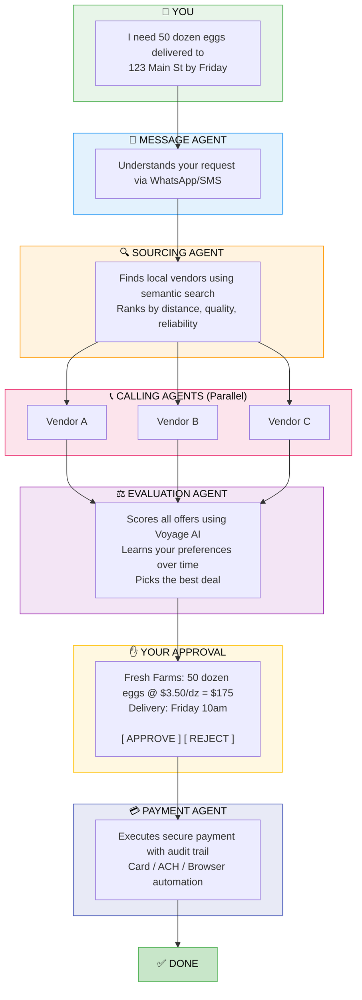

# Haggl

<p align="center">
  
</p>

<h3 align="center">Bringing Back Control to Business Owners</h3>

<p align="center">
  <strong>AI-powered procurement autopilot that sources, negotiates, and pays—so you don't have to.</strong>
</p>

<p align="center">
  <a href="https://github.com/haggl/haggl/blob/main/LICENSE">
    
  </a>
</p>

<p align="center">
  <a href="#quick-start">Quick Start</a> •
  <a href="#how-it-works">How It Works</a> •
  <a href="#agents">Agents</a> •
  <a href="#tech-stack">Tech Stack</a> •
  <a href="docs/API.md">API Docs</a> •
  <a href="#demo">Demo</a>
</p>

---


https://github.com/user-attachments/assets/fce6f16a-5f53-49ec-921b-d1d9211a6aa8


## The Problem

Small business owners spend **8+ hours per week** on procurement—calling suppliers, comparing prices, chasing invoices. That's time stolen from customers, creativity, and growth.

## The Solution

Send a message like *"I need 50 dozen eggs delivered Friday"* and Haggl handles everything:

- 🔍 **Finds** the best local vendors instantly
- 📞 **Calls** multiple suppliers simultaneously  
- 💰 **Negotiates** bulk pricing automatically
- ⚖️ **Evaluates** all offers and picks the best deal
- ✅ **Waits** for your one-click approval
- 💳 **Pays** securely with full audit trail

**You decide what to buy. AI handles the rest. You approve the final deal.**

---

## Quick Start

```bash
# Clone and install
git clone https://github.com/your-org/haggl.git
cd haggl
pip install -e .

# Configure environment
cp env.example .env
# Edit .env with your API keys

# Start backend
python main.py  # Runs on port 8001

# Start frontend (separate terminal)
cd frontend && npm install && npm run dev
```

Then open [http://localhost:3000](http://localhost:3000) and complete onboarding.

---

## How It Works



---

## Agents

| Agent | What It Does | Powered By |
|-------|--------------|------------|
| **Message Agent** | Conversational ordering via WhatsApp/SMS. Understands natural language requests. 
| **Sourcing Agent** | Semantic search for wholesale suppliers. Extracts pricing, ratings, certifications.
| **Calling Agent** | Real phone calls to negotiate bulk pricing. Natural voice conversations. 
| **Evaluation Agent** | Scores vendors on price, quality, reliability. Learns your preferences. 
| **Payment Agent** | Executes secure payments. Supports card, ACH, browser automation.

---

## Features

### 💬 Order via WhatsApp
Text your needs in plain English. No apps to download, no forms to fill.

### 📞 Parallel Negotiations
Calls 3+ vendors simultaneously. Gets you competitive quotes in minutes, not hours.

### 🎯 Smart Vendor Selection
AI evaluates every offer on price, quality, reliability, and distance. Learns what matters to you.

### 👁️ Real-Time Dashboard
Watch every agent action as it happens. Full transparency into the procurement process.

### ✅ One-Click Approval
Review the best deal and approve instantly. You stay in control.

### 🔒 Secure Payments
Full audit trail. Encrypted credentials. Optional x402 blockchain authorization.

---

## Tech Stack

| Layer | Technology | Purpose |
|-------|------------|---------|
| **Backend** | FastAPI + Python | Async API server |
| **Frontend** | Next.js 14 + React | Real-time dashboard |
| **Database** | MongoDB Atlas | State, history, audit logs |
| **AI** | OpenAI GPT-4 | Function calling, conversation |
| **Voice** | Vapi | Outbound phone calls |
| **Search** | Exa.ai | Semantic vendor discovery |
| **Embeddings** | Voyage AI | Vendor scoring & preferences |
| **Messaging** | Vonage | WhatsApp Business API |
| **Payments** | Stripe / Browserbase | Card, ACH, portal automation |
| **Auth** | x402 (Coinbase CDP) | Optional blockchain authorization |

---

## Project Structure

```
Haggl/
├── src/
│   ├── server.py                 # FastAPI main application
│   ├── events.py                 # Real-time SSE event streaming
│   │
│   ├── message_agent/            # WhatsApp/SMS ordering
│   │   ├── agent.py              # Conversation handler
│   │   └── tools/
│   │       ├── vonage_tool.py    # WhatsApp integration
│   │       ├── sourcing_tool.py  # Bridges to Sourcing Agent
│   │       ├── order_tool.py     # Bridges to Calling Agent
│   │       └── evaluation_tool.py# Bridges to Eval Agent
│   │
│   ├── sourcing_agent/           # Vendor discovery
│   │   ├── agent.py              # Search orchestration
│   │   └── tools/
│   │       └── exa_tool.py       # Exa.ai semantic search
│   │
│   ├── calling_agent/            # Voice negotiations
│   │   ├── agent.py              # Call state machine
│   │   └── tools/
│   │       └── vapi_tool.py      # Vapi voice API
│   │
│   ├── evaluation_agent/         # Vendor scoring
│   │   ├── agent.py              # Scoring logic
│   │   └── tools/
│   │       └── voyage_tool.py    # Voyage AI embeddings
│   │
│   ├── payment_agent/            # Payment execution
│   │   ├── executor.py           # Payment orchestration
│   │   ├── browserbase.py        # Cloud browser automation
│   │   └── schemas.py            # Payment types
│   │
│   ├── x402/                     # Blockchain authorization
│   │   ├── authorizer.py         # Budget enforcement
│   │   ├── wallet.py             # CDP wallet
│   │   └── escrow.py             # Escrow management
│   │
│   └── storage/                  # MongoDB persistence
│       ├── database.py           # Connection management
│       ├── vendors.py            # Vendor storage
│       ├── orders.py             # Order tracking
│       ├── calls.py              # Call history
│       └── businesses.py         # Business profiles
│
├── frontend/                     # Next.js dashboard
│   ├── app/
│   │   ├── orders/               # Order management
│   │   ├── new-order/            # Create new order
│   │   └── onboarding/           # Business setup
│   └── lib/
│       └── useAgentEvents.ts     # SSE event hook
│
├── main.py                       # CLI entry point
├── pyproject.toml                # Python dependencies
└── env.example                   # Environment template
```

---

## Environment Variables

```bash
# OpenAI
OPENAI_API_KEY=sk-...

# Vapi (Voice Calls)
VAPI_API_KEY=...
VAPI_PHONE_NUMBER_ID=...

# Vonage (WhatsApp)
VONAGE_API_KEY=...
VONAGE_API_SECRET=...
VONAGE_WHATSAPP_NUMBER=14157386102

# Exa.ai (Search)
EXA_API_KEY=...

# Voyage AI (Embeddings)
VOYAGE_API_KEY=...

# MongoDB
MONGODB_URI=mongodb+srv://...
MONGODB_DB=haggl

# Optional: x402 Blockchain Auth
WALLET_PRIVATE_KEY=0x...
ESCROW_WALLET_ADDRESS=0x...
```

---

## Demo

### Via WhatsApp (Recommended)

1. Complete onboarding at [http://localhost:3000/onboarding](http://localhost:3000/onboarding)
2. Send a WhatsApp message to the Vonage sandbox number
3. Watch the live dashboard as agents work
4. Approve the best deal with one click

### Via Dashboard

1. Go to [http://localhost:3000/new-order](http://localhost:3000/new-order)
2. Select products and enter delivery details
3. Click "Start Negotiation"
4. Watch agents source, call, and evaluate
5. Approve and pay

---

## API Endpoints

| Endpoint | Method | Description |
|----------|--------|-------------|
| `/orders/create` | POST | Create order and start agent flow |
| `/orders/pending` | GET | Get orders awaiting approval |
| `/orders/approve` | POST | Approve order and trigger payment |
| `/events/stream` | GET | SSE stream for real-time updates |
| `/webhooks/vonage/inbound` | POST | WhatsApp message webhook |
| `/calling/call` | POST | Initiate vendor call |
| `/sourcing/search` | POST | Search for vendors |

---

## Contributors

- **Anirudh Kuppili**
- **Karthik Reddy**
- **Spencer Yang**
- **Walter Richard**

---

## License

MIT License

---

<p align="center">
  <strong>Your AI procurement team. Your rules. Your time back.</strong>
</p>

<p align="center">
  Built for the MongoDB Agentic Orchestration and Collaboration Hackathon, January 2026
</p>
