# Haggl Architecture

## Overview

Haggl is a multi-agent AI system designed to automate procurement for small businesses. This document describes the high-level architecture, data flows, and design decisions.

## System Architecture

```mermaid
flowchart TB
    subgraph CLIENT["CLIENT LAYER"]
        NextJS["🖥️ Next.js App<br/>(Dashboard)"]
        WhatsApp["📱 WhatsApp/SMS<br/>(Vonage)"]
        REST["🔌 REST Client<br/>(Postman)"]
        SSE["📡 SSE Stream<br/>/events/stream"]
        
        NextJS & WhatsApp & REST --> SSE
    end

    subgraph API["API LAYER"]
        FastAPI["⚡ FastAPI Server<br/>(src/server.py)"]
        Webhooks["/webhooks/*<br/>(Vonage, Vapi)"]
        Orders["/orders/*<br/>(CRUD, Approve)"]
        Events["/events/*<br/>(SSE Stream)"]
        
        FastAPI --> Webhooks & Orders & Events
    end

    subgraph AGENTS["AGENT LAYER"]
        Message["💬 Message Agent<br/>(Vonage)"]
        Sourcing["🔍 Sourcing Agent<br/>(Exa.ai)"]
        Calling["📞 Calling Agent<br/>(Vapi)"]
        Evaluation["⚖️ Evaluation Agent<br/>(Voyage AI)"]
        Payment["💳 Payment Agent<br/>(Stripe)"]
        
        Message --> Sourcing --> Calling --> Evaluation --> Payment
    end

    subgraph DATA["DATA LAYER"]
        MongoDB[("🍃 MongoDB Atlas")]
        vendors[(vendors)]
        orders[(orders)]
        calls[(calls)]
        convos[(convos)]
        businesses[(businesses)]
        
        MongoDB --- vendors & orders & calls & convos & businesses
    end

    CLIENT --> API
    API --> AGENTS
    AGENTS --> DATA

    style CLIENT fill:#e3f2fd,stroke:#1976d2,color:#000
    style API fill:#fff3e0,stroke:#f57c00,color:#000
    style AGENTS fill:#f3e5f5,stroke:#7b1fa2,color:#000
    style DATA fill:#e8f5e9,stroke:#388e3c,color:#000
```



## Agent Architecture

### Agent Communication Pattern

```mermaid
sequenceDiagram
    participant U as 👤 User
    participant M as 💬 Message Agent
    participant S as 🔍 Sourcing Agent
    participant C as 📞 Calling Agent
    participant E as ⚖️ Evaluation Agent
    participant P as 💳 Payment Agent

    U->>M: "I need 12 dozen eggs"
    
    Note over M: 1. Parse intent (OpenAI)<br/>2. Extract: eggs, 12, dozen

    M->>S: Find vendors for eggs
    
    Note over S: 3. Search Exa.ai<br/>4. Return top 3 vendors

    S-->>M: [Vendor A, B, C]

    par Parallel Calls
        M->>C: Call Vendor A
        M->>C: Call Vendor B
        M->>C: Call Vendor C
    end

    Note over C: 5-7. Negotiate pricing<br/>Collect transcripts & quotes

    C-->>M: Call results

    M->>E: Evaluate all offers
    
    Note over E: 8. Score on price, quality<br/>9. Apply learned preferences<br/>10. Pick best vendor

    E-->>M: Best: Vendor B @ $42

    M->>U: "Vendor B: $42 - Approve?"
    U->>M: ✅ Approve

    M->>P: Execute payment
    
    Note over P: 11-13. Process payment<br/>Generate receipt

    P-->>M: Payment confirmed
    M-->>U: "Order confirmed! $42 from Vendor B"
```



### Agent Responsibilities

| Agent | Purpose | External APIs | Key Features |
|-------|---------|---------------|--------------|
| **Message Agent** | User communication | Vonage (WhatsApp/SMS) | OpenAI function calling, conversation history |
| **Sourcing Agent** | Vendor discovery | Exa.ai | Semantic search, vendor metadata extraction |
| **Calling Agent** | Price negotiation | Vapi | Voice AI, parallel calls, transcript capture |
| **Evaluation Agent** | Vendor selection | Voyage AI | Preference learning, multi-criteria scoring |
| **Payment Agent** | Transaction execution | Stripe, Browserbase | Mock payments, ACH automation |

## Data Models

### Core Entities

```python
# Order Lifecycle
class OrderDocument:
    order_id: str           # UUID
    business_id: str        # Reference to business
    product: str            # "eggs"
    quantity: int           # 12
    unit: str               # "dozen"
    status: OrderStatus     # pending → calling → evaluating → approved → paid
    vendor_id: str | None   # Selected vendor
    price: float | None     # Final price
    created_at: datetime
    updated_at: datetime

# Call Record
class CallDocument:
    call_id: str            # Vapi call ID
    order_id: str           # Reference to order
    vendor_id: str          # Reference to vendor
    status: CallStatus      # initiated → connected → completed → failed
    transcript: str | None  # Full conversation
    quoted_price: float | None
    duration_seconds: int
    created_at: datetime

# Vendor Profile
class VendorDocument:
    vendor_id: str
    name: str
    phone: str
    products: list[str]
    quality_score: float    # 0-100
    reliability_score: float
    certifications: list[str]
    embedding: list[float]  # 1536-dim vector
```

### Event Schema

```python
class AgentEvent:
    event_type: EventType   # stage_change, log, call_update, etc.
    stage: AgentStage       # sourcing, calling, evaluating, etc.
    order_id: str | None
    message: str
    data: dict | None
    timestamp: datetime
```

## Event-Driven Architecture

### Server-Sent Events (SSE)

The frontend subscribes to real-time updates via SSE:

```
GET /events/stream?order_id=xxx

event: stage_change
data: {"stage": "sourcing", "message": "Finding vendors..."}

event: call_update
data: {"vendor_name": "Farm Fresh", "status": "connected"}

event: approval_required
data: {"best_vendor": {...}, "price": 45.00}
```

### Event Flow

```mermaid
flowchart LR
    A["🤖 Backend<br/>Agents"] -->|emit| B["📬 EventBus<br/>Queue"]
    B -->|push| C["📡 SSE<br/>Stream"]
    C -->|recv| D["⚛️ Frontend<br/>React"]

    style A fill:#f3e5f5,stroke:#7b1fa2,color:#000
    style B fill:#fff3e0,stroke:#f57c00,color:#000
    style C fill:#e3f2fd,stroke:#1976d2,color:#000
    style D fill:#e8f5e9,stroke:#388e3c,color:#000
```



## Concurrency Model

### Parallel Vendor Calling

```python
async def place_orders_parallel(vendors: list[VendorInfo]) -> list[CallResult]:
    """Call up to 3 vendors simultaneously."""
    
    tasks = [
        call_single_vendor(vendor, product, quantity)
        for vendor in vendors[:3]
    ]
    
    # Execute all calls in parallel
    results = await asyncio.gather(*tasks, return_exceptions=True)
    
    return [r for r in results if not isinstance(r, Exception)]
```

### Background Task Processing

Long-running operations run in background tasks:

```python
@app.post("/orders/create")
async def create_order(request: CreateOrderRequest):
    order_id = str(uuid.uuid4())
    
    # Return immediately
    asyncio.create_task(
        process_order_flow(order_id, request)
    )
    
    return {"order_id": order_id, "status": "processing"}
```

## Security Architecture

### Authentication Flow

```mermaid
flowchart LR
    A["🖥️ Client"] -->|JWT| B["⚡ Server<br/>Validate"]
    B -->|Query| C[("🍃 MongoDB")]

    style A fill:#e3f2fd,stroke:#1976d2,color:#000
    style B fill:#fff3e0,stroke:#f57c00,color:#000
    style C fill:#e8f5e9,stroke:#388e3c,color:#000
```



### Webhook Verification

```python
def verify_webhook_signature(payload: bytes, signature: str) -> bool:
    """Verify Vonage webhook signatures."""
    expected = hmac.new(
        VONAGE_SECRET.encode(),
        payload,
        hashlib.sha256
    ).hexdigest()
    return hmac.compare_digest(expected, signature)
```

## Deployment Architecture

### Production Setup

```mermaid
flowchart TB
    CF["☁️ CLOUDFLARE<br/>(CDN + DDoS Protection)"]

    subgraph Compute["Compute Layer"]
        Frontend["🖥️ Frontend<br/>(Vercel)"]
        Backend1["⚡ Backend 1<br/>(Fly.io)"]
        Backend2["⚡ Backend 2<br/>(Fly.io)"]
    end

    MongoDB[("🍃 MongoDB Atlas<br/>(M10+ Cluster)")]

    CF --> Frontend & Backend1 & Backend2
    Backend1 & Backend2 --> MongoDB

    style CF fill:#fff3e0,stroke:#f57c00,color:#000
    style Compute fill:#e3f2fd,stroke:#1976d2,color:#000
    style MongoDB fill:#e8f5e9,stroke:#388e3c,color:#000
```



### Environment Configuration

| Variable | Description | Required |
|----------|-------------|----------|
| `OPENAI_API_KEY` | OpenAI API key | ✅ |
| `VAPI_API_KEY` | Vapi.ai API key | ✅ |
| `VONAGE_API_KEY` | Vonage API key | ✅ |
| `MONGODB_URI` | MongoDB connection string | ✅ |
| `EXA_API_KEY` | Exa.ai API key | ✅ |
| `VOYAGE_API_KEY` | Voyage AI key | Optional |

## Performance Considerations

### Optimization Strategies

1. **Connection Pooling**: MongoDB driver maintains connection pool
2. **Async I/O**: All network calls use `httpx` async client
3. **Event Batching**: SSE events are buffered before sending
4. **Caching**: Vendor embeddings cached in memory (hot data)

### Scalability Path

- **Horizontal**: Add more backend instances behind load balancer
- **Vertical**: Increase MongoDB cluster tier
- **Async Workers**: Move heavy processing to Celery/RQ workers

## Future Architecture

### Planned Enhancements

1. **Vector Search**: Native MongoDB Atlas Vector Search for vendors
2. **Multi-tenancy**: Business isolation at database level
3. **Webhook Queue**: Redis-backed webhook processing queue
4. **Agent Memory**: Long-term memory via vector database
5. **A/B Testing**: Feature flags for agent behavior variants
